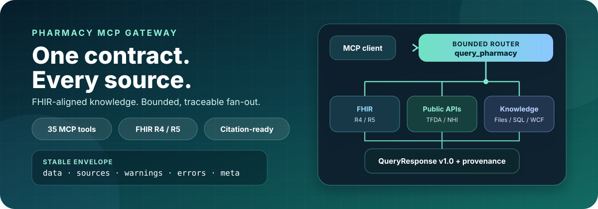
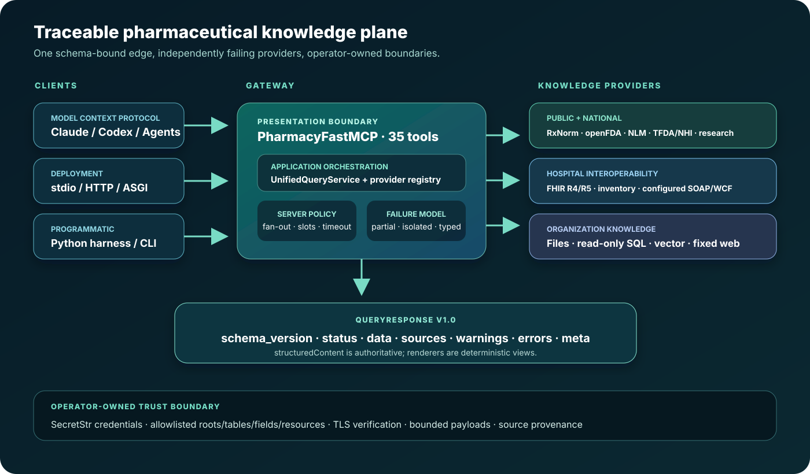
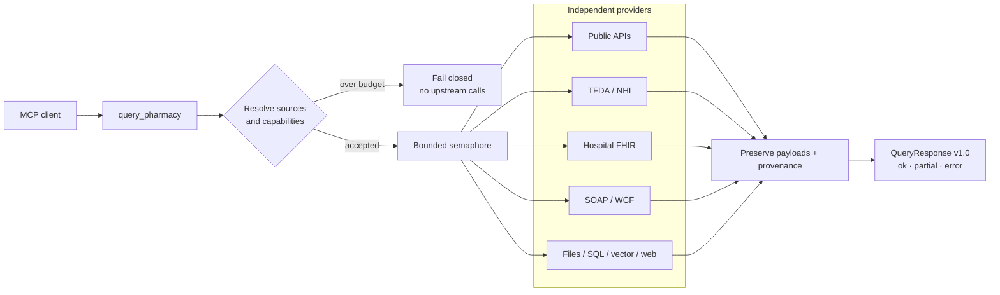
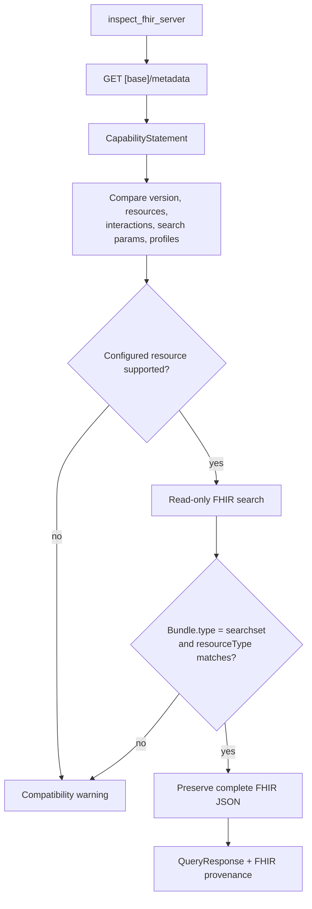
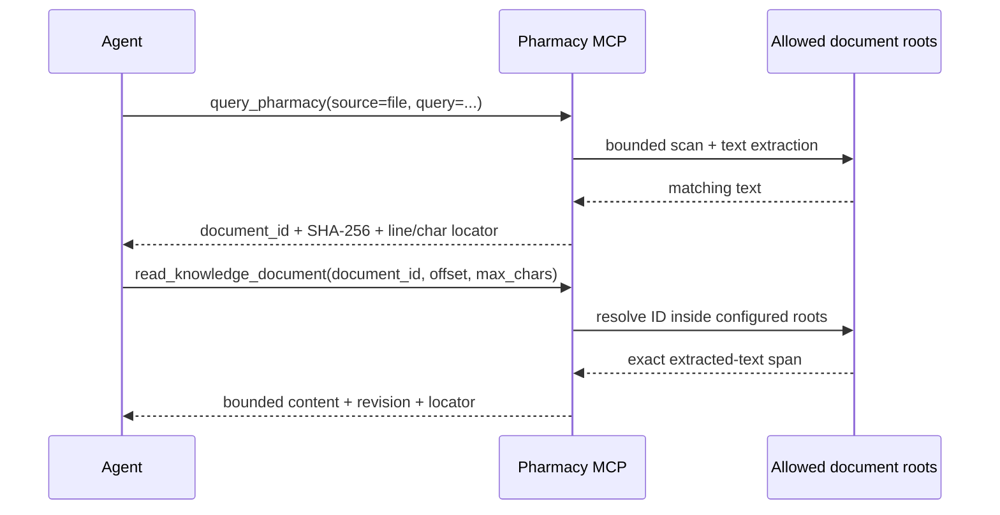

# Pharmacy MCP Gateway

[](https://github.com/u9401066/pharmacy-mcp/actions/workflows/ci.yml)
[](https://www.python.org/)
[](https://modelcontextprotocol.io/)
[](https://hl7.org/fhir/)
[](LICENSE)
[](https://u9401066.github.io/pharmacy-mcp/)



Pharmacy MCP is a modern, read-mostly pharmaceutical knowledge gateway for
agents. One traceable contract connects public drug APIs, Taiwan TFDA/NHI,
hospital FHIR and inventory, configured SOAP/WCF, local documents, read-only
SQL, vector search, fixed web resources, and trusted PK/DDI simulations.

[繁體中文](README.zh-TW.md) · [Documentation](https://u9401066.github.io/pharmacy-mcp/) · [Architecture](ARCHITECTURE.md) · [Connector guide](docs/connectors.md)

> **1.0 prerelease:** reference data only. It is not medical advice and does not
> replace a pharmacist, physician, or validated clinical decision-support system.

## What the gateway guarantees

| Guarantee | Runtime behavior |
|---|---|
| One agent entry point | `query_pharmacy` routes by explicit source or capability across heterogeneous providers. |
| Bounded parallelism | Operators control provider count, concurrency, timeout, payload size, and result limits; callers cannot widen them. |
| Stable machine output | All 35 tools return strict `QueryResponse` v1.0 `structuredContent`; JSON and Markdown are deterministic views. |
| Partial success | One failed or unsupported provider cannot erase successful results from the others. |
| Evidence provenance | Provider payloads, source references, warnings, typed errors, execution policy, and document locators stay separate. |
| Hospital-safe boundaries | FHIR is read-only; paths, SQL, endpoints, URLs, resources, and projected fields are operator-allowlisted. |

## Architecture at a glance



The gateway resolves compatible providers before starting work, rejects a
query that exceeds the configured provider budget, then runs accepted providers
through a semaphore. A timeout starts only after a provider obtains an execution
slot, so queue time is not misreported as an upstream timeout.



## Knowledge and API coverage

| Surface | Included adapters and behavior |
|---|---|
| Drug identity and labels | RxNorm/RxClass, all seven openFDA drug surfaces, DailyMed, PubChem, MedlinePlus Connect |
| Evidence discovery | PubMed, ClinicalTrials.gov, ChEMBL, Open Targets |
| Taiwan | TFDA permits, official NHI monthly drug items, price/ATC/effective dates, coverage rules, terminology |
| Hospital interoperability | FHIR R4/R5 medication, order, dispense, inventory, and supply; configured SOAP/WCF; bundled formulary |
| Organization knowledge | PDF, DOC/DOCX, CSV, XLS/XLSX, Markdown, text, read-only SQLite, vector gateway, fixed HTTPS pages |
| PK/DDI | Trusted formula catalog, concentration-time estimates, mechanistic CYP inhibition screening, validation fixtures |
| Licensed catalog | DrugBank, FDB, and Micromedex remain discoverable as `license_required`; they are never scraped or presented as enabled without a license |

`list_knowledge_sources` is the runtime source of truth for capabilities,
registration state, credential requirements, and implementation status. The
[coverage matrix](docs/coverage-matrix.md) and [data-source catalog](docs/data-sources.md)
show the executable evidence behind each surface. A scheduled workflow probes
18 official API and dataset surfaces weekly without downloading large Taiwan datasets.

## FHIR-aligned hospital queries

The FHIR adapter targets common medication workflows without forcing unlike
resources into a lossy universal record. Standard FHIR resources are returned
as their original JSON objects, preserving core fields, `meta.profile`,
`extension`, and hospital-defined keys. The common MCP layer standardizes the
query and response envelope—not the clinical resource itself.

| Intent | FHIR resources | Guardrail |
|---|---|---|
| Identity and formulary | `Medication`, `MedicationKnowledge` | Configurable resource allowlist; bounded search results |
| Patient orders and dispensing | `MedicationRequest`, `MedicationDispense` | Queried only when authorized callers explicitly provide `context.patient_id` |
| R5 inventory | `InventoryItem`, `InventoryReport` | Capability-specific query; unsupported resources become warnings |
| R4 supply fallback | `SupplyDelivery`, optionally `SupplyRequest` | Server-advertised support can be compared before rollout |



Set `PHARMACY_MCP_FHIR_BASE_URL` to register the adapter, then call
`inspect_fhir_server` to compare the live server contract with the configured
resource set. Bearer credentials are loaded from `SecretStr` settings and are
never accepted as MCP arguments or returned in tool output. See
[FHIR and inventory](docs/fhir.md).

## Citation-ready documents, SQL, and internal APIs

Organization connectors expose a narrow retrieval capability rather than a
general file, database, or network client:

- File search is restricted to configured roots and supported formats. Every
  match includes an opaque stable document ID, extracted-text SHA-256, exact
  half-open character span, line range, and surrounding snippet.
- `read_knowledge_document` resolves only that document ID and returns at most
  50,000 characters. It never accepts a caller-supplied path.
- SQLite opens with `mode=ro` and uses administrator-declared tables, search
  columns, output columns, and bound values—never caller SQL.
- Vector gateways receive only the query, limit, and explicit vector filters;
  patient context is not forwarded.
- Web retrieval uses fixed credential-free HTTPS URLs, no redirects, SSRF
  checks, and byte limits.
- SOAP/WCF is a generic configured provider with TLS verification, safe XML
  parsing, snapshot caching, record/byte limits, and search/output field
  allowlists. Real internal contracts stay outside the repository.



Start with the [organization connector guide](docs/connectors.md). Private API
archives, real endpoints, actions, credentials, and field contracts must remain
in ignored local configuration and must not be copied into commits or packages.

## Quick start

Requires Python 3.11+ and [uv](https://docs.astral.sh/uv/).

```bash
git clone https://github.com/u9401066/pharmacy-mcp.git
cd pharmacy-mcp
uv sync --all-extras
uv run pharmacy-mcp
```

The same catalog can run over stdio, Streamable HTTP, or ASGI:

```bash
uv run pharmacy-mcp --transport streamable-http --host 127.0.0.1 --port 8000
uvicorn pharmacy_mcp.presentation.server:app --host 127.0.0.1 --port 8000
```

Minimal MCP client configuration:

```json
{
  "mcpServers": {
    "pharmacy": {
      "command": "uv",
      "args": ["run", "pharmacy-mcp"],
      "cwd": "/absolute/path/to/pharmacy-mcp"
    }
  }
}
```

Copy `.env.example` to an ignored `.env` and enable only the connectors needed
by the deployment. The checked-in example uses placeholders exclusively.

## Query examples

A compound MCP query:

```json
{
  "query": "warfarin",
  "capabilities": ["identity", "label", "reimbursement", "formulary"],
  "sources": ["rxnorm", "dailymed", "tw-tfda", "tw-nhi", "local-formulary"],
  "limit": 10,
  "output_format": "json_compact",
  "locale": "zh-TW"
}
```

The authoritative top-level contract is always:

```text
schema_version · status · data · sources · warnings · errors · meta
```

For a shell or non-MCP workflow:

```bash
uv run pharmacy-query warfarin \
  --source local-formulary \
  --capability formulary \
  --format json_compact
```

The Python API exposes the same contract through
`pharmacy_mcp.application.harness.PharmacyHarness`. Agents can load the bundled
`pharmacy-query-contract` prompt and must preserve all seven response fields,
never invent missing clinical facts, and never flatten multiple sources into a
single implied authority. See the [agent harness guide](docs/agent-harness.md)
and [response contract](docs/architecture/response-contract.md).

## Security defaults

| Boundary | Default posture |
|---|---|
| Credentials | Environment-backed `SecretStr`; not accepted as tool parameters |
| FHIR | Read-only, TLS verified, resource allowlist, explicit patient context |
| WCF | Credential-free HTTPS URL, no redirects, defused XML, bounded cached snapshot |
| Files | Configured roots only; no symlinks, traversal, arbitrary paths, or oversized files |
| SQL | SQLite URI `mode=ro`, allowlisted schema projection, bound values |
| Vector/web | Fixed endpoints, SSRF restrictions, bounded outbound and inbound payloads |
| Multi-provider execution | Server-owned provider budget, semaphore, timeout, isolated partial failures |

## Development and verification

```bash
uv sync --all-extras
uv run ruff format --check .
uv run ruff check .
uv run mypy src
uv run pytest
uv run mkdocs build --strict
uv build
uv run python scripts/audit_release_artifacts.py
```

CI covers Python 3.11–3.13, branch coverage, strict typing/linting, security
scanning, documentation, package builds, and installed-wheel MCP smoke tests.
The repository uses segmented Conventional Commits and an updated Memory Bank.
See [CONTRIBUTING.md](CONTRIBUTING.md), [SECURITY.md](SECURITY.md), and
[CHANGELOG.md](CHANGELOG.md).

## License

Apache License 2.0. Upstream datasets and commercial knowledge bases retain
their own terms, attribution requirements, and clinical-use restrictions.
