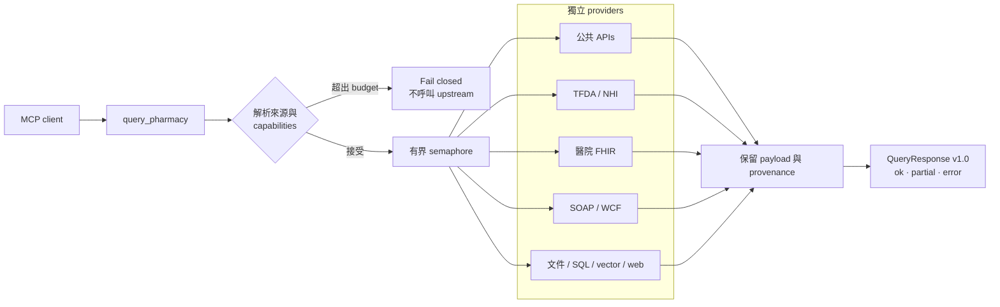
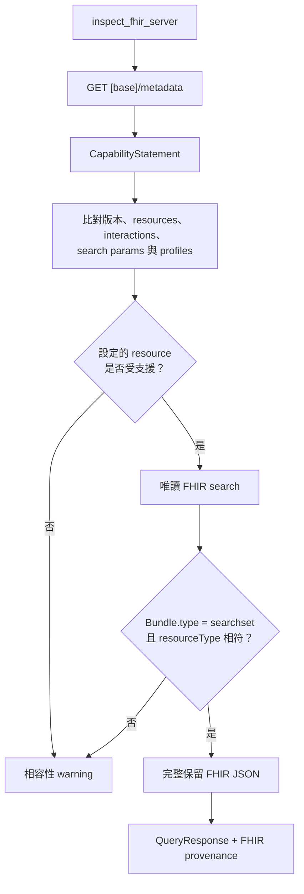
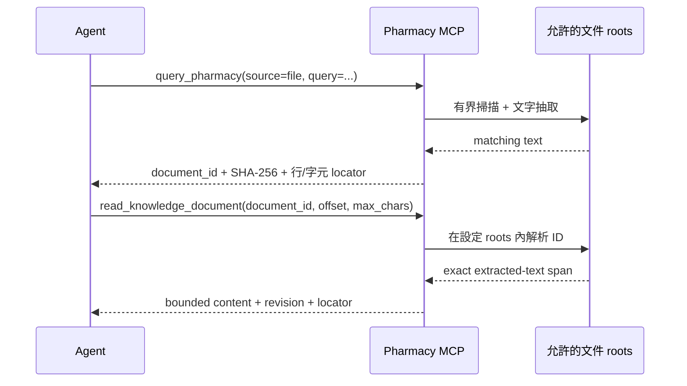

# Pharmacy MCP 藥品知識閘道

[](https://github.com/u9401066/pharmacy-mcp/actions/workflows/ci.yml)
[](https://www.python.org/)
[](https://modelcontextprotocol.io/)
[](https://hl7.org/fhir/)
[](LICENSE)
[](https://u9401066.github.io/pharmacy-mcp/)


Pharmacy MCP 是為 Agent 設計的現代化、read-mostly 藥品知識閘道。它以一份可追溯
契約整合公共藥品 API、台灣 TFDA/NHI、醫院 FHIR 與庫存、設定式 SOAP/WCF、
院內文件、唯讀 SQL、向量搜尋、固定 Web 資源，以及可信任 PK/DDI 模擬。

[English](README.md) · [說明網站](https://u9401066.github.io/pharmacy-mcp/) · [架構](ARCHITECTURE.md) · [連接器指南](docs/connectors.md)

> **1.0 prerelease：** 所有內容只供參考，不構成醫療建議，也不能取代藥師、
> 醫師或經驗證的臨床決策支援系統。

## 閘道提供的保證

| 保證 | Runtime 行為 |
|---|---|
| Agent 單一入口 | `query_pharmacy` 依明確來源或 capability 路由不同協議的 provider。 |
| 有界平行查詢 | 管理者控制 provider 數、同時執行數、timeout、payload 與結果上限；caller 不能放寬。 |
| 穩定機器輸出 | 全部 35 tools 回傳嚴格 `QueryResponse` v1.0 `structuredContent`；JSON/Markdown 只是 deterministic view。 |
| 部分成功 | 單一來源失敗或不支援，不會抹除其他來源的成功結果。 |
| 證據可追溯 | Provider payload、來源、警告、typed errors、執行 policy 與文件 locator 分開保留。 |
| 院內安全邊界 | FHIR 唯讀；path、SQL、endpoint、URL、resource 與輸出欄位皆由管理者 allowlist。 |

## 架構總覽


閘道會先解析相容 provider；若超出設定的 provider budget，就在任何 upstream
request 發生前 fail closed。接受的 provider 才會進入 semaphore。Timeout 從取得
execution slot 後才開始，避免把排隊時間錯算成 upstream timeout。



## 知識與 API 覆蓋

| 知識面 | 已整合 adapter 與行為 |
|---|---|
| 藥品識別與標籤 | RxNorm/RxClass、openFDA 全七個藥品端點、DailyMed、PubChem、MedlinePlus Connect |
| 證據探索 | PubMed、ClinicalTrials.gov、ChEMBL、Open Targets |
| 台灣 | TFDA 許可證、健保署官方每月藥品項目、藥價/ATC/有效日期、給付規則、藥名對照 |
| 醫院互通 | FHIR R4/R5 藥品、醫囑、調劑、庫存與供應；設定式 SOAP/WCF；bundled formulary |
| 組織知識 | PDF、DOC/DOCX、CSV、XLS/XLSX、Markdown、text、唯讀 SQLite、vector gateway、固定 HTTPS 文件 |
| PK/DDI | 可信任公式 catalog、濃度時間估算、機轉式 CYP 抑制 screening、驗證 fixtures |
| 商業資料 catalog | DrugBank、FDB、Micromedex 維持 `license_required`；未授權時不抓取也不假裝啟用 |

`list_knowledge_sources` 是 runtime 真實狀態，會列出 capability、註冊狀態、
credential 需求與實作進度。[覆蓋矩陣](docs/coverage-matrix.md)與
[資料來源總覽](docs/data-sources.md)提供每個知識面的可執行證據。每週排程會檢查
18 個官方 API／資料集入口，而且不下載台灣的大型資料檔。

## 對齊 FHIR 的院內查詢

FHIR adapter 對準常見藥事 workflow，但不會把不同 resource 強壓成會遺失資料的
共同最小 record。標準 FHIR resource 以原始 JSON object 回傳，保留 core fields、
`meta.profile`、`extension` 與醫院自訂 keys。共同 MCP layer 標準化的是查詢與
回應 envelope，不是臨床 resource 本身。

| 查詢意圖 | FHIR resources | Guardrail |
|---|---|---|
| 藥品識別與 formulary | `Medication`、`MedicationKnowledge` | 可設定 resource allowlist；有界搜尋結果 |
| 病人醫囑與調劑 | `MedicationRequest`、`MedicationDispense` | 只有授權 caller 明確提供 `context.patient_id` 才查詢 |
| R5 庫存 | `InventoryItem`、`InventoryReport` | 依 capability 啟動；不支援的 resource 降級為 warning |
| R4 供應 fallback | `SupplyDelivery`，可選 `SupplyRequest` | 上線前可比對 server 宣告的能力 |



設定 `PHARMACY_MCP_FHIR_BASE_URL` 才會註冊 adapter，之後呼叫
`inspect_fhir_server`，即可將 live server 契約與設定的 resource 集合比對。
Bearer credential 由 `SecretStr` 設定讀取，不接受 MCP argument，也不會出現在
tool output。詳見 [FHIR 與庫存](docs/fhir.md)。

## 可引用文件、SQL 與院內 API

組織連接器只提供窄化的 retrieval capability，不會暴露通用檔案、資料庫或網路 client：

- File search 只查設定 roots 與支援格式。每筆 match 包含 opaque stable document
  ID、extracted-text SHA-256、精確 half-open 字元 span、行範圍及周邊 snippet。
- `read_knowledge_document` 只解析該 document ID，最多回傳 50,000 字元；完全
  不接受 caller-supplied path。
- SQLite 以 `mode=ro` 開啟，使用管理者宣告的 table、search columns、output
  columns 與 bound values，永不接受 caller SQL。
- Vector gateway 只接收 query、limit 與明確 vector filters，不轉送 patient context。
- Web retrieval 僅使用固定、無 credential 的 HTTPS URLs，不跟 redirect，並設
  SSRF 與 byte limits。
- SOAP/WCF 是泛化設定式 provider，具備 TLS 驗證、安全 XML parser、snapshot
  cache、record/byte limits 與 search/output field allowlists；真實院內契約留在 repo 外。



請由[組織連接器指南](docs/connectors.md)開始設定。私有 API archives、真實
endpoint、action、credential 與 field contract 必須留在 ignored 本機設定，
不得複製進 commit 或 package。

## 快速開始

需要 Python 3.11+ 與 [uv](https://docs.astral.sh/uv/)。

```bash
git clone https://github.com/u9401066/pharmacy-mcp.git
cd pharmacy-mcp
uv sync --all-extras
uv run pharmacy-mcp
```

相同 catalog 可透過 stdio、Streamable HTTP 或 ASGI 執行：

```bash
uv run pharmacy-mcp --transport streamable-http --host 127.0.0.1 --port 8000
uvicorn pharmacy_mcp.presentation.server:app --host 127.0.0.1 --port 8000
```

最小 MCP client 設定：

```json
{
  "mcpServers": {
    "pharmacy": {
      "command": "uv",
      "args": ["run", "pharmacy-mcp"],
      "cwd": "/absolute/path/to/pharmacy-mcp"
    }
  }
}
```

將 `.env.example` 複製成 ignored `.env`，只啟用部署需要的 connectors。Repo 內
範例完全使用 placeholder。

## 查詢範例

複合 MCP 查詢：

```json
{
  "query": "warfarin",
  "capabilities": ["identity", "label", "reimbursement", "formulary"],
  "sources": ["rxnorm", "dailymed", "tw-tfda", "tw-nhi", "local-formulary"],
  "limit": 10,
  "output_format": "json_compact",
  "locale": "zh-TW"
}
```

權威 top-level contract 永遠是：

```text
schema_version · status · data · sources · warnings · errors · meta
```

非 MCP workflow 可使用同一份契約：

```bash
uv run pharmacy-query warfarin \
  --source local-formulary \
  --capability formulary \
  --format json_compact
```

Python 可直接使用 `pharmacy_mcp.application.harness.PharmacyHarness`。Agent 可載入
bundled `pharmacy-query-contract` prompt，且必須保留七個 response fields、不得
補造缺失臨床事實，也不得把多來源扁平化成單一虛構權威。詳見
[Agent harness](docs/agent-harness.md)與
[response contract](docs/architecture/response-contract.md)。

## 預設安全邊界

| 邊界 | 預設姿態 |
|---|---|
| Credentials | 環境變數支援的 `SecretStr`；不接受 tool parameters |
| FHIR | 唯讀、驗證 TLS、resource allowlist、明確 patient context |
| WCF | 無 credential HTTPS URL、不跟 redirects、defused XML、有界 cached snapshot |
| Files | 僅設定 roots；拒絕 symlink、traversal、任意 path 與超大檔案 |
| SQL | SQLite URI `mode=ro`、allowlisted schema projection、bound values |
| Vector/web | 固定 endpoints、SSRF 限制、有界 outbound/inbound payloads |
| Multi-provider execution | Server-owned provider budget、semaphore、timeout、隔離 partial failures |

## 開發與驗證

```bash
uv sync --all-extras
uv run ruff format --check .
uv run ruff check .
uv run mypy src
uv run pytest
uv run mkdocs build --strict
uv build
uv run python scripts/audit_release_artifacts.py
```

CI 覆蓋 Python 3.11–3.13、branch coverage、strict typing/linting、security scan、
文件、package build 與 installed-wheel MCP smoke。Repo 採分段 Conventional
Commits 並同步 Memory Bank。詳見 [CONTRIBUTING.md](CONTRIBUTING.md)、
[SECURITY.md](SECURITY.md)與 [CHANGELOG.md](CHANGELOG.md)。

## 授權

程式碼採 Apache License 2.0。外部資料集與商業知識庫仍各自適用其授權、
attribution 與臨床使用限制。
