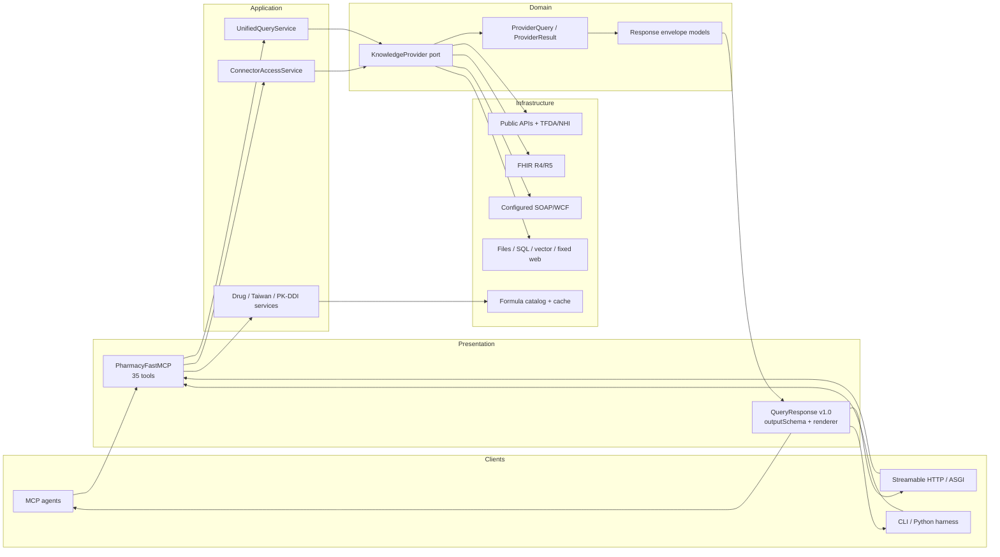
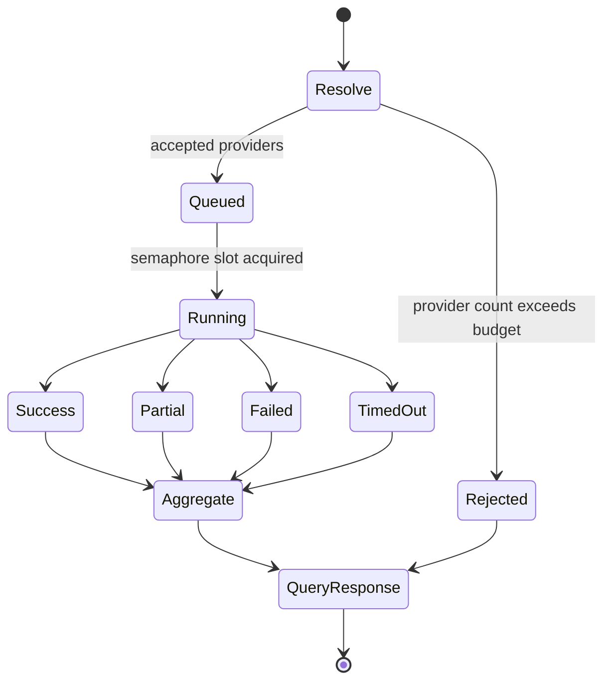
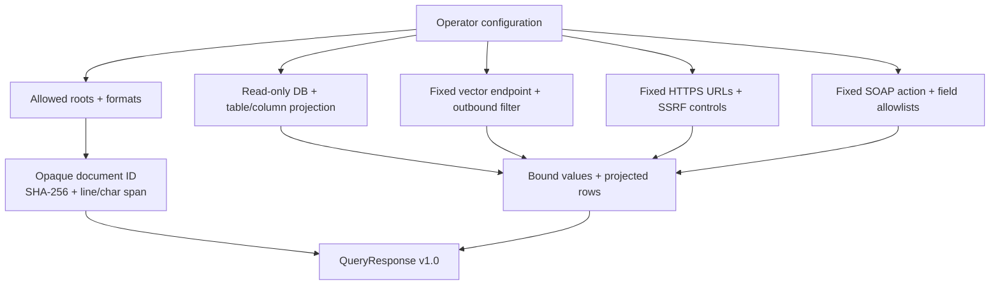

# System Architect

Updated: 2026-07-24

## Current system shape

Pharmacy MCP is a schema-bound gateway, not a collection of unrelated tool
wrappers. FastMCP owns the transport contract, the application layer owns
orchestration and provider policy, domain models define provider and response
ports, and infrastructure adapters retain protocol-specific behavior.



The detailed repo-native diagram is maintained at
`docs/assets/pharmacy-mcp-architecture.svg`; both READMEs embed it directly.

## Dependency direction

```text
Presentation ──uses──▶ Application ──uses──▶ Domain
      │                    │                    ▲
      └──────── wiring ────┴──▶ Infrastructure ┘
```

- Domain models have no MCP, HTTP, file, or database dependency.
- Application services coordinate ports and policies; they do not parse SOAP,
  FHIR bundles, spreadsheets, or SQL rows.
- Infrastructure adapters implement protocol-specific access and projections.
- Presentation maps every result through one output schema at the transport edge.

## Query execution model



Policy is server-owned through `provider_max_per_query`,
`provider_max_parallel`, and `provider_timeout_seconds`. The timeout begins
inside the semaphore slot. Provider failures remain typed and isolated; any
successful provider data produces `partial` rather than being discarded.

## FHIR interoperability boundary

FHIR resource semantics remain native. The gateway validates the search
container and expected `resourceType`, then retains each complete resource JSON
including standard fields, extensions, profiles, and hospital-defined keys.

| Capability | Resources |
|---|---|
| Identity/formulary | `Medication`, `MedicationKnowledge` |
| Patient medication context | `MedicationRequest`, `MedicationDispense` |
| R5 inventory | `InventoryItem`, `InventoryReport` |
| R4 supply fallback | `SupplyDelivery`, optional `SupplyRequest` |
| Capability inspection | `CapabilityStatement` from `[base]/metadata` |

The FHIR adapter is read-only. Patient-scoped searches require explicit
`context.patient_id`; authorization acquisition and rotation belong to hospital
infrastructure. Unsupported resources, search parameters, or profiles become
observable compatibility data or warnings.

## Organization connector boundary



No connector accepts arbitrary caller paths, SQL, endpoint URLs, or credentials.
The WCF provider exposes only a generic read contract. Real organization
endpoint/action/field values and private archives remain ignored local assets.

## Tool catalog

| Group | Tools |
|---|---|
| Gateway and discovery | `query_pharmacy`, `list_knowledge_sources`, `get_nhi_data_status` |
| Connector access | `read_knowledge_document`, `inspect_fhir_server` |
| Drug knowledge | `search_drug`, `get_drug_info`, `get_drug_dosage`, `get_drug_warnings` |
| Interactions and dose calculation | 9 interaction, dose, renal, infusion, and conversion tools |
| Taiwan | 6 TFDA/NHI and terminology tools |
| Formulary/order compatibility | 7 formulary, renal-adjustment, validation, and order tools |
| Trusted simulation | 5 formula, mechanism, PK, and concentration tools |

Total: 35 tools. `structuredContent` is authoritative for every tool and always
contains `schema_version`, `status`, `data`, `sources`, `warnings`, `errors`, and
`meta`.

## Deployment and release boundary

- stdio, SSE, Streamable HTTP, mounted ASGI, Python harness, and CLI share the
  same service and response models.
- Service creation and the ASGI app are lazy to avoid import-time resources.
- CI covers Python 3.11–3.13, branch coverage, Ruff, strict mypy, Bandit,
  MkDocs strict build, wheel/sdist, and installed-wheel MCP smoke.
- Build artifacts are scanned for secrets, private contract values, and private
  archive names before publication.
